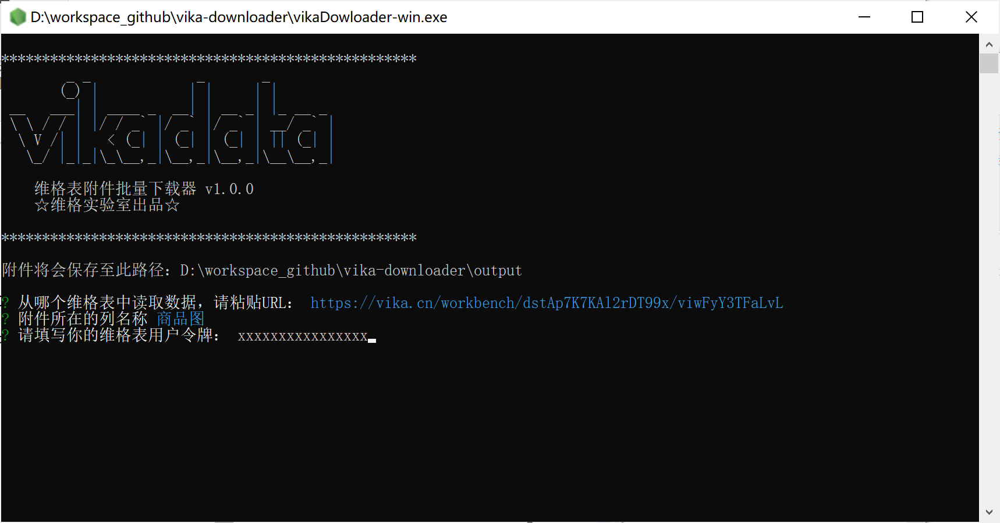

# vika-downloader

维格表附件批量下载器，一个命令即可批量导出整个表的所有附件。




## 🎨 介绍

无需编程，双击即可执行。输入维格表的URL和要下载的附件列名称，最后再填写个人的 API TOKEN ，回车即开始批量下载~

已实现如下功能：
- [x] 支持所有类型的附件下载（原计划只是想下载图片、后面发现好像都可以~）
- [x] 同名文件不会覆盖，会自动以 “_” 加序号重命名
- [x] 最高支持10个附件并发下载
- [x] 基于pkg实现可执行文件的打包，支持多平台运行（windows、MacOS已适配）

## 🔨 使用方法

**Windows**
将 dist 文件夹下的 vikaDownloader-win.exe 复制到你喜欢的其他文件夹里，双击即可执行。

> 注意：被下载的附件会保存在 **output** 文件夹（与 vikaDownloader-win.exe 同级）


**MacOS**
将 dist 文件夹下的 vikaDownloader-macos 复制到你喜欢的其他文件夹里，通过如下方式执行

```bash
// 授予“可执行”权限
sudo chmod +x vikaDownloader-macos

// 执行下载器
./vikaDownloader-macos
```


## 二次开发

如有更多想法，你可以下载本工程进行二次开发，下列是文件树：

```
vika-downloader
├─ .gitignore
├─ assets
│  └─ vikaDowloader-win_rN4szoATLb.png
├─ dist   // 预编译好的可执行文件
│  ├─ vikaDowloader-macos   // MacOS环境下的下载器执行文件
│  └─ vikaDowloader-win.exe // Windows环境的exe可执行文件
├─ index.js // CLI版本的下载器
├─ package-lock.json
├─ package.json
├─ pkgbuilder.js    // 工程主入口 JS 文件
└─ readme.md

```

本工程使用 [Nodejs](https://nodejs.org/en/) 和 [pkg](https://www.npmjs.com/package/pkg) 进行技术实现。

pkg 负责将 JS 文件编译打包成不同平台下可执行的程序，官方解释：

> This command line interface enables you to package your Node.js project into an executable that can be run even on devices without Node.js installed.

### 编译示例:
```bash
// 基于 node 14 同时编译 windows 环境和 macos 环境的批量下载器可执行程序
pkg pkgbuilder.js -t node14-win-x64,node14-macos-x64 -o ./dist/vikaDownloader

// 上述指令已写入package.json，所以你还可以如下执行编译
npm run build

```

### Q & A

如果是使用的维格表专有云版本，需要自定API请求的host，可以修改 `pkgbuilder.js` 的如下位置：
```javascript
var appConfig = {
    //...
    host: "https://api.vika.cn/fusion/v1" //将此处的域名改为专有云部署的域名或IP
}
```
